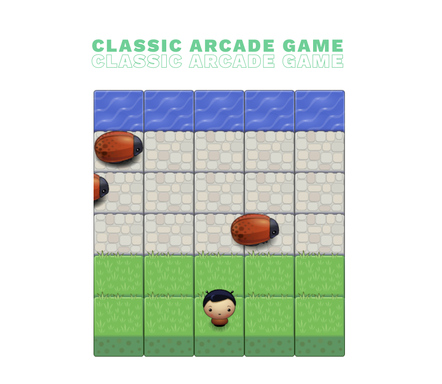

# Udacity FEND Classic Arcade Game Clone Project

## Set up

This project is a classic Frogger-like game where the player tries to reach the water before getting run over by enemies, as part of the Udacity front-end nanodegree program. Download this repository and open up the project, and prepare to start clicking.

## Instructions

Move the player with you computer's arrow keys, dodge the enemies and try to reach the water! Once you've hit the water, you have won.

## Dependencies

This game is created all in HTML, CSS & Javascript. 

### Screencap

